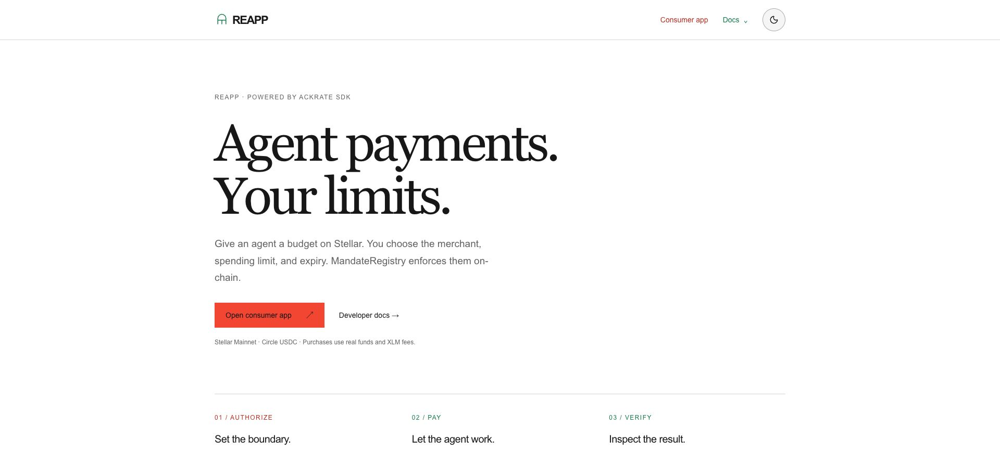

# Functional brand colors

Owner direction, September 25, 2026: green identifies Ackrate's corporate, infrastructure, enforcement and evidence layer; red identifies consumer choices and intervention. This supersedes the previous neutral/red-only app convention. REAPP's name, arch geometry, transaction behavior and status wording remain the same.

`app/brand-colors.css` is mirrored from the private wiki's functional-color policy and uses the exact Allow It edition 01.1 and Ackrate brand-book values:

| Role | Bright | Muted / supporting |
| --- | --- | --- |
| Consumer decision | #F34632 | #BA2D22 for small red text on light surfaces |
| Infrastructure / enforcement | #B9F36A | #157A4B for readable emphasis; #123D2C forest; #E7F1E6 mist |

Use bright red with #111110 labels for consumer-action fills. On hover use deeper red with #FAFAF7 labels. Red on light backgrounds uses the darker text shade at small sizes; large display accents can use the bright shade. In dark mode, readable green uses lime and readable red uses bright vermilion. Green/lime is not a decorative network-status dot.

The homepage, consumer entry navigation, descriptive authorization step, developer links and Ackrate mark are green/neutral. Red starts at a concrete intent/authorization control, feedback request or denial, not at a link to a consumer page. Wallet primary actions and the current step are red. Completed checks, ready configuration and settlement evidence use green while preserving labels/checkmarks. Unknown network/loading states remain neutral. Destructive actions retain explicit wording and an outlined treatment distinct from ordinary continuation.

Do not restore gradients, glows or 3D to the flat wallet. Do not alter authentication, budget validation, payment submission or recovery for a color change. Never infer permission or payment success from a color.

The canonical policy is in `ackrate-private/wiki/ackrate/visual-language.md`, and the cross-session outcome is ACK-002 in its task register. The Allow It marketing site keeps its existing red-led identity; only direct Ackrate references should acquire green. Archived experiments are evidence, not a fleet of active deployment targets.

## First-pass validation and screenshots (superseded navigation)

Node22 production build, TypeScript, branding gate and276 existing wallet tests passed. Actual Chrome captures cover desktop1920×871 and phone390×844, light and dark. Browser computed values match F34632 for primary consumer actions with111110 labels; navigation uses157A4B in light mode and B9F36A in dark mode. Phone controls remain46px high with no horizontal overflow. These are presentation checks, not a funded wallet acceptance run.

The local development server encountered the existing instrumentation/Postgres edge-bundling error; visual validation used the successful production build with the background CLI runner disabled. No server/payment code was changed to work around it.

[Dark app](previews/dual-brand/desktop-dark.png) · [Light wallet](previews/dual-brand/wallet-light.png) · [Dark wallet](previews/dual-brand/wallet-dark.png) · [Phone light](previews/dual-brand/mobile-wallet-light.png) · [Phone dark](previews/dual-brand/mobile-wallet-dark.png)

The owner clarified that infrastructure stays predominantly green; red is sparse and tied to intervention, never a whole chapter or ordinary navigation. Fable UX and Opus 5.5 frontend review were attempted on September 25 but both returned HTTP 401 (revoked OAuth), before model usage. The mechanical scope correction is not specialist sign-off.

## Corrected navigation captures

[Light](previews/intervention-only/app-light.png) · [Dark](previews/intervention-only/app-dark.png). Homepage navigation and descriptive steps remain green/neutral. TypeScript and the production build pass after the correction; wallet/payment behavior is unchanged.
