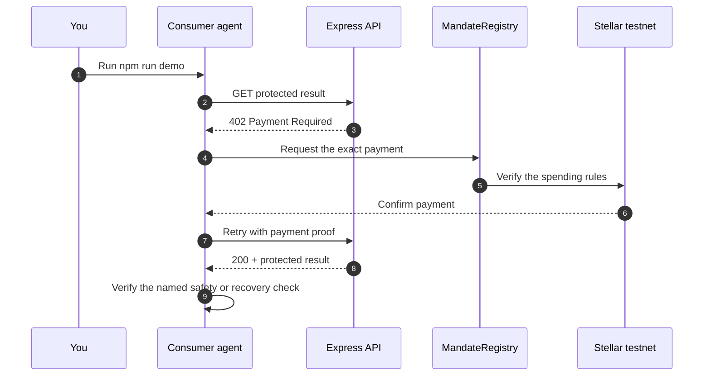

# Research Source Scout

**A research agent buys ranked market, academic, and news sources, then stops when its mandate cannot fund a fourth source.**

This starter protects `GET /source/:sourceId` with a request-bound payment on Stellar testnet. The app asks; the MandateRegistry contract decides whether money moves.

## Run locally

You need Node.js 22 or newer. You do not need a wallet or a GitHub repo.

### If you used Copy setup command

The setup command on [reapp.ackrate.com/docs/quickstarts](https://reapp.ackrate.com/docs/quickstarts) already downloaded this starter, extracted it into your empty folder, and ran `npm ci`. Before extraction, it verified the ZIP against the exact SHA-256 in the [public integrity manifest](https://reapp.ackrate.com/starters/v1/manifest.json). In the same VS Code terminal, run:

```bash
npm run demo
```

### If you downloaded the ZIP manually

Compare its SHA-256 with the [public integrity manifest](https://reapp.ackrate.com/starters/v1/manifest.json), extract the ZIP, open a terminal in the extracted folder, then run:

```bash
npm ci
npm run demo
```

The demo creates disposable testnet accounts, starts the consumer and Express fulfillment service, and prints concise status lines and transaction links. It never requests a wallet or mainnet secret.

## Optional hosted walkthrough

The local demo above is the primary starter flow. The optional browser companion requires a separately configured persistent runtime. Its hosted availability is not verified by the local demo. When that runtime is available:

1. Open [the hosted walkthrough](https://reapp.ackrate.com/docs/hosted).
2. Start the optional hosted walkthrough.
3. Copy the displayed `npm run hosted -- --endpoint=... --merchant=...` command into this project's VS Code terminal and press **Enter**.

The browser and terminal then show the same hosted paid flow. Your private signers and recovery evidence stay in this local folder.

## Continue on Mainnet

Research Source Scout alone also includes a separate published reference runner, pinned to @ackrate/cli 0.2.1. It makes three request-bound USDC purchases and verifies that a fourth exceeds the budget. It does not run the custom Testnet scenario on Mainnet. The other starter scenarios remain Testnet-only.

Use Node.js 22 or newer and the Stellar CLI. Before running, configure a named user transaction signer, a named agent identity, and a distinct merchant public address. Stellar CLI signs the user's transactions. The supplied agent environment key signs both the agent's transactions and detached request proofs; the named agent identity is only used to verify that the supplied key has the expected public address. The user and agent each need at least 0.50 spendable XLM after reserves, with additional headroom for transaction fees; the user needs at least the chosen USDC budget. Both user and merchant need authorized canonical USDC trustlines with capacity. Supply the agent key through a private environment variable or secret manager. Its public key must match the named agent identity. Stellar CLI Secure Store identities deliberately do not export this raw key, so an existing nonexportable agent identity cannot supply this runner. Use a dedicated supported private file identity or a secret provider that can securely supply the matching agent key. Keep file identities outside the repository and media artifacts, in a private directory with restrictive permissions. Do not bypass Secure Store or place a secret in an argument, this README, logs, or a recording.

The launcher uses the published CLI's canonical Mainnet registry and USDC manifest, readiness checks, and durable pending-settlement guards. There is no funding helper or network/manifest override. Inspect the names, merchant, price, budget, and available fee balance before explicitly consenting:

```bash
npm run demo:mainnet -- --help
npm run demo:mainnet -- --user-signer my-mainnet-user --agent-signer my-mainnet-agent --agent-secret-env ACKRATE_AGENT_SECRET --merchant G_REPLACE_WITH_MERCHANT_PUBLIC_ADDRESS --price 0.01 --budget 0.03 --confirm-real-usdc
```

The budget must cover three prices but remain below four prices. The second command transfers up to 0.03 USDC for three results, plus XLM network fees. The example merchant placeholder must be replaced. The confirmation flag is required and is never added automatically. CLI preflight must pass before registration, allowance, or payments.

Mainnet recovery state stays in this project's private, Git-ignored `.ackrate-mainnet/` directory, regardless of an inherited `ACKRATE_HOME`. Keep that same folder for retries. Unresolved settlement evidence stops another run; follow the CLI recovery instructions instead of deleting state or starting in a different folder. `npm run reset` archives only the default Testnet `.ackrate/` state and rejects custom reset paths in this starter. It never resets Mainnet. Inspect pending evidence with the installed, pinned CLI from the project folder. These commands only reconcile retained settlements; they do not start another purchase.

Mac / Linux:

```bash
ACKRATE_HOME="$PWD/.ackrate-mainnet" node node_modules/@ackrate/cli/dist/ackrate-cli.bundle.mjs settlement reconcile
```

Windows PowerShell:

```powershell
$env:ACKRATE_HOME = Join-Path (Get-Location).Path '.ackrate-mainnet'
node node_modules/@ackrate/cli/dist/ackrate-cli.bundle.mjs settlement reconcile
```

Use that same pinned CLI path and Mainnet state directory for any later recovery command. Review the retained receipt and delivery outcome before acknowledging it; do not acknowledge merely to clear a blocker. A setup-registration recovery requires its exact transaction hash and the same original identities. Never reset pending state or blindly start another demo.

## What the Testnet run verifies

No real money is used. The consumer receives HTTP 402, pays through the contract, and receives HTTP 200 with the protected result. The SDK runner prints one-line status updates and transaction links.

The terminal shows the local fulfillment server starting, accepted Stellar testnet payment evidence with explorer transaction hashes, the protected result delivered to the consumer, and the named negative or recovery check reaching its documented outcome.



## Scenario

- Paid resource: `GET /source/:sourceId`
- Price policy: exact decimal amounts declared by the scenario
- Safety or recovery check: `budget-exhausted`
- Expected outcome: The fourth purchase is rejected on-chain because its exact amount exceeds the mandate's remaining authority.
- Fixtures: Four stable JSON sources with fixed identifiers, prices, relevance scores, and per-source provenance.

Rank sources by relevance, purchase the three planned sources sequentially, retain per-source provenance and evidence, and record the rejected fourth source without creating a paid delivery.

### Capabilities

- `verified-bound-purchase`
- `cumulative-budget`
- `request-binding`
- `independent-verification`
- `explorer-evidence`

## Make it yours

Start with these three files:

| File | What to change |
|---|---|
| `scenario/scenario.mjs` | Your product's rules, sample data, delivery checks, and rejection check. |
| `src/consumer.mjs` | How your app requests and pays for the protected result. |
| `src/fulfillment.mjs` | What your paid Express endpoint returns. |

The shared payment and recovery code lives in `shared/`. Leave it unchanged until your project needs advanced customization.

## Run fulfillment separately

The one-command demo starts both sides automatically. To inspect or modify the server independently:

```bash
cp .env.example .env
# Put a funded Stellar testnet public G-address in ACKRATE_MERCHANT.
npm run fulfillment
```

Keep the challenge secret private and stable. The reference file store is for one local Node process; multi-process deployments need one shared linearizable store implementing the same interface.

## Safety and recovery

- Paid work is GET-only and bound to the exact origin, method, resource, merchant, asset, amount, registry, and short-lived challenge.
- Delivery evidence is committed before the client acknowledges and clears a settlement receipt.
- Exact same-proof replay returns byte-identical recovery; an old proof on a new resource is rejected, and a freshly rebound proof reusing an old transaction conflicts.
- State under `.ackrate/` is private and ignored by Git. Run `npm run reset` only after all payment and fulfillment evidence is resolved.

Catalog identity: `research-source-scout` · fixture policy: `deterministic-and-clearly-labeled`.
